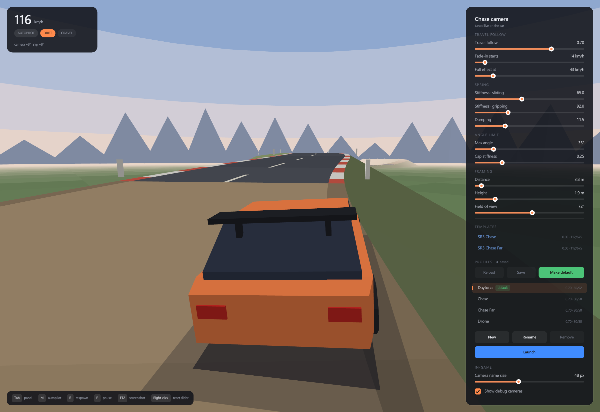

# CamLab

*Part of [SR3CamLab](README.md), by Ninja Dynamics.*

CamLab is a small driving playground for tuning SR3CamLab's chase-camera profiles. A
low-poly rally hatchback drives an endless, procedurally generated stage, and the panel on
the right changes the camera live. The camera in CamLab is the same model the patch puts
into SEGA Rally 3, and it reads and writes the same `profiles.yaml`. What you tune here is
what you get in the game.



- [Running it](#running-it)
- [Controls](#controls)
- [The panel](#the-panel)
- [The profile file](#the-profile-file)
- [The camera model](#the-camera-model)
- [How close is CamLab to the game?](#how-close-is-camlab-to-the-game)
- [Building](#building)
- [Command line](#command-line)

## Running it

`camlab.exe` belongs in the `SR3CamLab` folder, next to `PLAY.bat`, `patch.ps1`,
`profiles.yaml` and `defaults.yaml`. It reads and writes those files there, and its
**Launch** button runs `PLAY.bat`. It runs on its own too, without the game, if you just
want to play with the camera.

The window opens tall enough to show the whole panel and scales with Windows' display
scaling. The UI uses Segoe UI from `%WINDIR%\Fonts` and falls back to raylib's built-in font
if it isn't there.

## Controls

| Key | |
|---|---|
| Tab | show / hide the panel |
| M | autopilot / manual driving |
| WASD or arrow keys | drive (manual) |
| Space | handbrake: kicks the car into a slide |
| R | respawn on the road |
| P | pause |
| F12 | screenshot, saved next to the .exe as `camlab_<time>.png` |

The **autopilot** drives like a player. It takes a racing line, plans its corner speeds and
flicks the car into slides, so the camera gets real drifts to react to.

The **HUD** (top left) shows the speed, autopilot or manual, the surface, and DRIFT and AIR
tags. Below them it shows the camera's swing angle and the car's slip angle. **Click the
speed** to switch between km/h and mph; the choice is saved in `profiles.yaml` as
`speedUnits`.

Hover over anything (sliders, buttons, section titles, HUD items) for a plain-words
explanation.

## The panel

### Sliders

Drag a slider, or hover it and use **Shift + mouse wheel** for fine steps. A value in
orange isn't saved yet. The **↺** icon next to it, or a right-click on the slider, puts it
back to its last saved value, which the small tick on the track marks.

| Group | Slider | YAML key | Range | What it does |
|---|---|---|---|---|
| Travel follow | Travel follow | `strength` | 0 – 1 | How much the camera looks where the car is *going* rather than where its nose points. 0 = SR3's camera (glued behind the bumper); higher swings the camera out in a drift so you see the car sideways. |
| | Fade-in starts | `fadeInStartKmh` | 0 – 150 km/h | Below this speed the swing is off (parking, reversing and crawling look normal). |
| | Full effect at | `fadeInFullKmh` | 1 – 250 km/h | From this speed the swing works at full strength; it fades in between the two. |
| Spring | Stiffness · sliding | `stiffnessMin` | 1 – 150 | How hard the camera is pulled back behind the car while it slides or flies. Low = lazy, floaty swings. |
| | Stiffness · gripping | `stiffnessMax` | 1 – 300 | The same while the tyres grip. High = snaps back quickly after a corner. |
| | Damping | `damping` | 0.5 – 40 | Stops the spring wobbling. Low = overshoots and sways, high = settles without bouncing. |
| Angle limit | Max angle | `maxAngle` | 5 – 180° | The farthest the camera may swing round the car (180 = no limit). |
| | Cap stiffness | `capStiffness` | 0 – 1 | How it meets that limit: low = slows down gently like a soft spring, 1 = a wall. It swings freely up to `maxAngle × capStiffness`. |
| Framing | Distance | `distance` | 3 – 16 m | How far behind the car the camera sits. |
| | Height | `height` | 0.5 – 8 m | How high the camera floats (see [the camera model](#the-camera-model)). |
| | Field of view | `fov` | 30 – 110° | Vertical lens angle. Wider = more scenery and speed, smaller car. |

### Templates

**SR3 Chase** and **SR3 Chase Far** (blue) are SEGA Rally 3's own chase cameras, built into
CamLab. Their sliders are locked and they can't be launched or made the default. Select one
and press **New** to make an editable profile from it; the copy's reset icon returns it to
the template.

### Profiles

- **Click** a profile to put it on the car. **Double-click** (or **Rename**) to rename it.
- **New** copies the selected profile (or template) under a new name. **Remove** deletes
  the selected profile. New, Rename and Remove save straight away.
- **Save** writes the selected profile's sliders to `profiles.yaml`. **Reload** throws away
  unsaved changes.
- **Make default** (green) saves the profile and makes it the one `PLAY.bat` starts on
  (tagged *default*).
- The **↺ next to a profile's name** appears when it differs from its factory values (its
  `preset` in `defaults.yaml`) and puts them back. Nothing is saved until you press Save.
- **Launch** (blue) starts the game on the selected profile *exactly as the sliders are*,
  unsaved changes included, without saving anything. It writes all profiles to
  `%TEMP%\SR3CamLab_launch.yaml` and runs `PLAY.bat <name> -ProfilesFile <that file>`.
  View Change in the game cycles through all of them as usual.

Factory profiles (`Daytona`, `Chase`, `Chase Far`, `Drone`) can be edited and renamed but
not removed.

### In-game

Settings for the game, not the camera. Both save straight away:

- **Camera name size:** how big the game shows a camera's name when you press View Change
  (pixels at 1080p, scaled to your resolution; 0 turns it off). YAML: `overlay`.
- **Show debug cameras:** whether View Change also offers the cameras SEGA hid (far chase,
  cockpit and its driver's-seat version, wheel, car rotate, free cams). YAML:
  `hiddenCameras`.

## The profile file

`profiles.yaml` holds your profiles. CamLab and `patch.ps1` both read it, and it is plain
YAML (a small subset: no lists, no anchors), so you can also edit it by hand:

```yaml
default: Daytona            # the profile PLAY.bat starts on (SR3 Chase / SR3 Chase Far too)
overlay: 48                 # camera name size on View Change, px at 1080p (0 = off)
hiddenCameras: true         # also offer the debug cameras the game hides
speedUnits: km/h            # CamLab's speedometer: km/h or mph

profiles:
  Daytona:
    strength: 0.7           # travel follow: 0 = behind the nose, 1 = along the slide
    fadeInStartKmh: 14      # the swing fades in between these two speeds
    fadeInFullKmh: 43
    stiffnessMin: 65        # camera spring while sliding or airborne
    stiffnessMax: 92        # camera spring while the tyres grip
    damping: 11.5           # low = sways, high = settles without bouncing
    maxAngle: 35            # furthest swing from straight behind (180 = no limit)
    capStiffness: 0.25      # how softly it slows down near that limit (1 = a wall)
    distance: 3.8           # framing: all three, or none to keep SR3's own
    height: 1.9
    fov: 72
    preset: Daytona         # its factory values in defaults.yaml
```

- Keys are case-insensitive. `maxAngle` and `capStiffness` are optional (no limit, 0.4).
- Framing is all or nothing: give `distance`, `height` and `fov` together, or leave all
  three out to keep SR3's own framing.
- Use a dot as the decimal separator.
- The patch accepts a slightly wider range than the sliders: stiffness up to 500, damping up
  to 100, distance 1 – 30 m, height 0 – 15 m, fov 20 – 120°.

`defaults.yaml` holds the factory profiles that the reset icons return to. Don't edit it by
hand: `camlab.exe --make-defaults` regenerates it from your current `profiles.yaml`.

## The camera model

Every frame, for the chase camera:

1. **Travel follow.** The camera's aim is a blend between the car's heading and its direction
   of travel: `aim = heading + strength × fade × slip`. `fade` ramps from 0 to 1 between the
   two fade-in speeds, and the effect also fades out as the slip angle passes 60–90°
   (spins, reversing).
2. **Spring.** The camera's yaw chases that aim on a damped spring. Its stiffness glides
   (time constant 0.35 s) towards `stiffnessMax` while the tyres grip and towards
   `stiffnessMin` while sliding or airborne; `damping` is the shock absorber.
3. **Angle limit.** The camera's offset from straight behind the car passes through a soft
   limiter. It is unchanged up to `knee = maxAngle × capStiffness`, then compressed so it
   approaches `maxAngle` smoothly without ever reaching it.
4. **Framing.** The camera pivots on a point 0.85 m behind the car's centre at roof height
   (1.4 m). It sits `distance` behind that point and `height − 1 m` above it, and looks
   straight at it. The field of view is vertical. So more height (or less distance) looks
   down more steeply.

In the game the patch puts steps 1 – 3 into SEGA Rally 3's own chase camera, replacing its
spring constants. The framing goes into the call that places the camera. In SR3's far chase
view the distance is ×1.25 and the height ×1.15, as in the stock game. The details are in
[FINDINGS.md](FINDINGS.md).

## How close is CamLab to the game?

- **Framing.** Measured in the running game: the camera objects, the final view matrix, the
  car's own matrix and screen captures. In the game, the point the camera aims at sits
  ~0.87 m behind the car's origin and the eye sits `distance` behind it at rest. At speed,
  that point trails the car, so the eye gets closer to it but not to the car. In captures at
  0 and 200 km/h the car is the same size on screen, so CamLab keeps the distance constant.
  CamLab's car is a box model of the right size (4.3 × 1.86 × 1.44 m), not SR3's C4, so
  expect the car itself to look slightly different.
- **Stages.** The generator is calibrated against SR3's own routes (Tropical, Canyon, Alpine,
  Lakeside), read from the game's route splines: about 45% straight, 7 corners per km (most
  of them 10 – 40° bends), 12% grades and 1 jump crest per km. Sections are tarmac, gravel,
  mud or snow.
- **Driving.** SR3's handling is light and slidey, and that is what makes a chase camera
  swing. The autopilot spends about half its time sideways (~20° of slip on average) and
  averages ~135 km/h with a ~218 km/h top speed.

Not modelled: the other cars, checkpoints and the time limit, SR3's car models, or its
debug cameras.

## Building

CamLab is one C99 file (`src/camlab.c`) built with [raylib](https://www.raylib.com) 5.5 into
a single, statically linked `camlab.exe`. It builds without warnings under
`-Wall -Wextra -Wpedantic -Wshadow`.

**Toolchain:** install raylib 5.5 for Windows (the installer from raylib.com) to
`C:\raylib`. It includes the w64devkit compiler (gcc, make, windres) with raylib already
set up.

**With `build.bat`:** double-click `src\build.bat`. It compiles CamLab, uses the new exe to
write the icon (from `res\icon.png`, or a drawn one if that file is missing), embeds it and
links again. The result is `camlab.exe` in the repository root. If raylib isn't in
`C:\raylib`, set `RAYLIB_DIR` first.

**With `make`** (from a w64devkit shell, or with `C:\raylib\w64devkit\bin` on the PATH):

```
make -C src            camlab.exe with its icon, in the repository root
make -C src noicon     the same without an icon (no windres needed)
make -C src selftest   src/camlab_test.exe, the simulation without a window
make -C src clean      remove the build leftovers
make -C src RAYLIB=D:/libs/raylib   raylib from elsewhere (with include/ and lib/)
```

**By hand** (no icon):

```
gcc src/camlab.c -o camlab.exe -O2 -std=c99 -Wall -Wextra -s -static -mwindows -lraylib -lopengl32 -lgdi32 -lwinmm
```

**Self-test:** built with `-DCAMLAB_SELFTEST`, the simulation (track, car, autopilot,
camera) runs without a window. It drives ten simulated minutes and prints speed, off-road
time, drift, jump and camera statistics. The argument is the random seed:

```
make -C src selftest
src\camlab_test.exe 3
```

## Command line

```
camlab.exe                                       the app
camlab.exe --make-defaults                       copy profiles.yaml into defaults.yaml (new factory values)
camlab.exe --shots [--seed N]                    render 5 frames (shot_0..4.png, 3.5 s apart) and exit
camlab.exe --seed N                              start on stage seed N
camlab.exe --write-icon file.ico [picture.png]   write the icon, drawn or from a picture (used by the build)
```
